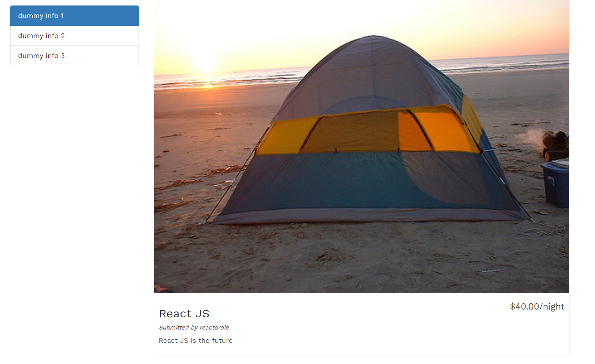

# YelpCamp
YelpCamp web application using Node.js | Express.js | MongoDB   (MEN Stack)

## Objective
* The goal is to build a yelp like web application for campgrounds where users can upload and provide review to campgrounds.
* The project was developed using technologies such as Node.js | Express.js | MongoDB (MEN Stack)

## System Design
### Architecture

 

### Technology stack

<table>
<thead>
<tr>
<th>Area</th>
<th>Technology</th>
</tr>
</thead>
<tbody>
	<tr>
		<td>Front-End</td>
		<td>HTML5, CSS3, Bootstrap</td>
	</tr>
	<tr>
		<td>Back-End</td>
		<td>Express, Node.js</td>
	</tr>
  	<tr>
		<td>Template Engine</td>
		<td>EJS (Embedded JavaScript)</td>
	</tr>
  <tr>
		<td>Authentication</td>
		<td>Passport.js</td>
	</tr>
	<tr>
		<td>Database</td>
		<td>MongoDB</td>
	</tr>
</tbody>
</table>

## Screenshots




## Steps for Project Execution :

```
cd YelpCamp
npm install
node server.js
````
